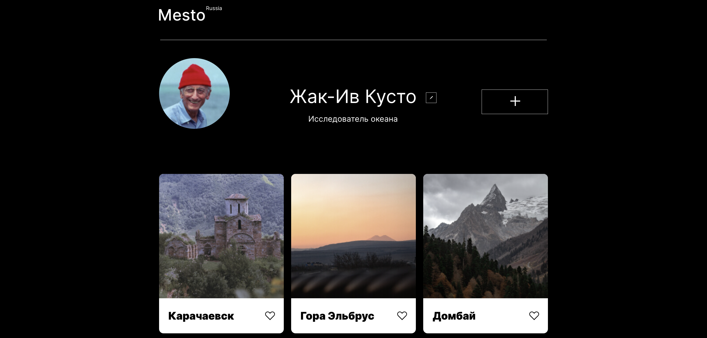

  

# Проект: [Место](https://darinadanilova.github.io/mesto/)

## В данном проекте Вы можете увидеть личный профиль исследователя океана Жака-Ив Кусто, насладиться расскладкой, выложенных им фотографий красивых мест в России и поставить лайк месту, которе Вы хотели бы псетить.

Здесь былы использованы, такие технологии, как:

* флексбокс-верстка;
* bem nested;
* семантические теги;
* grid layout;
* адаптивная верстка с Mobile-First подходом;
* работа с Figma;
* работа с Perfect Pixel;
* подключение шрифтов;
* PopUp;
* формы;
* кнопки;
* JavaScript.

### Планы по доработке проекта:

- сделать лайки активными;
- отправлять данные пользователя на сервер.